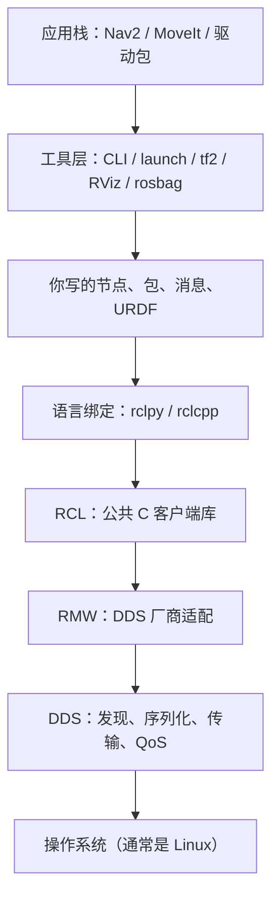

# 第 18 章 ROS 2 安装、概念与工作空间

| 字段 | 内容 |
|------|------|
| 状态 | 进行中 |
| 周次 | Week 10–11 |
| 路线 | 主干 |
| 对应项目 | `P04` |
| 所属篇 | `part3` |

## 需要掌握

- 发行版锁死 Humble 或 Jazzy，不用 ROS 1
- 能讲清 ROS 2 解决发现、通信、启动、生态接口，不代替算法
- 能画出分层：DDS/RMW → RCL → rclpy → 节点与工具 → 应用栈，并指出个人开发落在哪一层
- node、topic、package、workspace、overlay 各是什么
- colcon build、先 source 系统再 source 工作空间的顺序
- turtlesim 能讲清计算图；自写发布/订阅能跑

## 关键内容

ROS 2 是中间件：帮多个进程发现彼此、按标准消息传数据、被 launch 一起拉起。EKF、A*、PID 仍是算法，不因进了节点就消失。
分层是为了换传输不换节点、Python 与 C++ 共用一张计算图。个人主写节点和包，调用 rclpy，用 CLI / RViz；本周不碰 DDS，不改 Nav2。
可与第二篇后半重叠安装，但 P03B 仍须完成后再把算法塞进回调。四种通信与 launch 见第 19 章，本周只做到 pub/sub。

## 推荐学习资料

### 必看（掌握本章）

- [fishros/d2l-ros2 第 1–2 章](https://github.com/fishros/d2l-ros2) 或 [在线教程](https://fishros.com/d2lros2/)
- [ROS 2 官方 Beginner](https://docs.ros.org/en/humble/Tutorials.html) 安装与 turtlesim
- PoRA Lab 0：Install ROS — 节奏对照

### 进阶拓展

- DDS / RMW 实现差异 — 多机通信时再读官方 Concepts
- [mmabas77 ROS 2 Roadmap 2025](https://github.com/mmabas77/ROS-2-Practical-Course-Roadmap-2025) — 实验课式周历
- Docker 内装 ROS — 环境隔离选修

## 实验清单

每条都先写清「要回答什么问题」，再给步骤和通过线。在 **Ubuntu 22.04（Humble）或 24.04（Jazzy）** 里做；macOS 宿主不要硬装 Desktop，用虚拟机或 Docker 进 Linux 再跑。每个新终端都要先 `source /opt/ros/$ROS_DISTRO/setup.bash`（工作空间编过之后再 overlay 一次 `install/setup.bash`）。

- [ ] **实验 A：环境自检**
    - **要回答的问题**：当前这台机器能不能跑 ROS 2？发行版是 Humble 还是 Jazzy？shell 有没有 source？
    - **步骤**：
        1. `echo $ROS_DISTRO`。若为空，先按 [官方安装](https://docs.ros.org/en/humble/Installation.html)（Jazzy 把 URL 里的 `humble` 换成 `jazzy`）装完，再 `source /opt/ros/<发行版>/setup.bash`，并考虑写进 `~/.bashrc`。
        2. `ros2 --help` 能列出子命令。
        3. `printenv | grep -E 'ROS_DISTRO|ROS_VERSION|RMW_IMPLEMENTATION'` 记进笔记。
    - **通过线**：`ROS_DISTRO` 为 `humble` 或 `jazzy`；`ROS_VERSION=2`。把发行版写进本仓库 `projects/p04_ros2_ws/README.md`（没有就新建一句）。

- [ ] **实验 B：turtlesim —— 不写代码先看计算图**
    - **要回答的问题**：节点和话题在运行时长什么样？谁在发速度指令、谁在听？
    - **步骤**（三个终端，都已 source 系统 ROS）：
        1. 若尚未安装：`sudo apt install ros-$ROS_DISTRO-turtlesim`
        2. 终端 1：`ros2 run turtlesim turtlesim_node`
        3. 终端 2：`ros2 run turtlesim turtle_teleop_key`，点一下该终端，用方向键让乌龟动。
        4. 终端 3 依次执行并保存输出：
            - `ros2 node list`
            - `ros2 topic list`
            - `ros2 topic info /turtle1/cmd_vel -v`
            - `ros2 topic echo /turtle1/cmd_vel --once`
            - `ros2 interface show geometry_msgs/msg/Twist`
            - `ros2 topic hz /turtle1/pose`（看几秒后 Ctrl+C）
    - **通过线**：能用自己的话讲清：teleop 往 `/turtle1/cmd_vel` 发 `Twist`，turtlesim 订阅后改海龟位姿，又往 `/turtle1/pose` 发布。把 `node list` 和 `topic list` 贴进笔记。

- [ ] **实验 C：colcon 工作空间与 overlay**
    - **要回答的问题**：自己的代码放哪、怎么编、另一个终端怎样才能 `ros2 run` 到它？
    - **步骤**（路径可改成你 Ubuntu 上 clone 的本书目录）：
        ```bash
        source /opt/ros/$ROS_DISTRO/setup.bash
        mkdir -p ~/ros2_ws/src
        cd ~/ros2_ws/src
        ros2 pkg create --build-type ament_python --license Apache-2.0 \
          --dependencies rclpy std_msgs demo_chatter
        cd ~/ros2_ws
        colcon build --packages-select demo_chatter
        source install/setup.bash
        ros2 pkg list | grep demo_chatter
        echo $AMENT_PREFIX_PATH
        ```
        观察：`AMENT_PREFIX_PATH` 应同时包含你的 `~/ros2_ws/install/...` 和 `/opt/ros/$ROS_DISTRO`。**新开的终端**如果只 source 了系统、没 source 工作空间，`ros2 pkg list` 里就没有 `demo_chatter`。
    - **通过线**：`colcon build` 成功；source 工作空间后能列出该包。笔记里写清「漏 source 时的现象」和你实际用的工作空间路径。若希望代码进本书仓库，把 `src/demo_chatter` 放到 `projects/p04_ros2_ws/src/` 再编一次。

- [ ] **实验 D：写一个发布节点（固定频率往外扔数据）**
    - **要回答的问题**：节点如何按定时器发布？启动后在图上叫什么名字？话题类型和名字是什么？
    - **步骤**：在 `demo_chatter` 包里放发布者（包名以你 `pkg create` 的为准）。最小逻辑如下，接到包的入口（`setup.py` 的 `console_scripts` 或 `ros2 run demo_chatter talker`）上：
        ```python
        import rclpy
        from rclpy.node import Node
        from std_msgs.msg import String

        class Talker(Node):
            def __init__(self):
                super().__init__('talker')
                self.pub = self.create_publisher(String, 'chatter', 10)
                self.timer = self.create_timer(0.5, self.tick)
                self.i = 0

            def tick(self):
                msg = String()
                msg.data = f'hello {self.i}'
                self.pub.publish(msg)
                self.get_logger().info(msg.data)
                self.i += 1

        def main():
            rclpy.init()
            node = Talker()
            rclpy.spin(node)
            node.destroy_node()
            rclpy.shutdown()
        ```
        改完后 `colcon build --packages-select demo_chatter`，source，再 `ros2 run demo_chatter talker`（入口名以 `setup.py` 为准）。另开终端：`ros2 topic echo /chatter`、`ros2 topic hz /chatter`。
    - **通过线**：echo 持续出现 `hello N`；hz 大约 2 Hz（定时器 0.5 s）。笔记记下节点名、话题名、消息类型、实测频率。对照：[Writing a simple publisher and subscriber (Python)](https://docs.ros.org/en/humble/Tutorials/Beginner-Client-Libraries/Writing-A-Simple-Py-Publisher-And-Subscriber.html)。

- [ ] **实验 E：订阅者 + 计算图（两个节点只靠话题耦合）**
    - **要回答的问题**：订阅者如何在完全不 `import` 发布者代码的情况下收到数据？关掉发布者之后图上会发生什么？
    - **步骤**：
        1. 按同一官方教程补一个 `listener` 节点，订阅 `/chatter`，`get_logger().info` 打印 `msg.data`。
        2. 两个终端分别 `ros2 run` talker 与 listener（都 overlay 了工作空间）。
        3. 第三个终端：`ros2 node list`、`rqt_graph`（需 `sudo apt install ros-$ROS_DISTRO-rqt-graph`；若命令是 `ros2 run rqt_graph rqt_graph` 也可以）。
        4. 停掉 talker，观察 listener 是否还刷新消息；再看 `rqt_graph`。
    - **通过线**：listener 日志与 talker 的 `hello N` 对应；`rqt_graph` 截图进笔记，能指出 `/chatter` 连着两个节点。口头讲清：耦合点是话题，不是 Python 模块。
    - **本章到此即可。** 服务、参数、Action、launch 一键起多节点是 [第 19 章](ch19-communication.md) 和 [P04](../projects/p04-ros2-ws.md)，不要本周一次做完。

## 笔记

以下整理自对 ROS 2「解决什么、怎么分层、个人写什么」的讨论。做完实验后，把命令输出、截图和踩坑补在文末表格里。

### ROS 2 主要解决什么

机器人软件几乎从来不是一个进程。激光驱动、定位、规划、控制、可视化各自独立跑，还要能换实现、能多机、能复用别人的包。

ROS 2 当 **中间件 / 操作系统式的胶水**，专门处理这几件事：

1. **发现**：节点起来之后，不用手写 IP 和端口，图上的其他节点能找到它（相对 ROS 1，不再依赖一个必须先起的 `roscore`）。
2. **通信**：按约定的消息类型传数据（话题、服务、动作），并带上 QoS（可靠性、队列深度等）。
3. **启动与配置**：用 launch 一次拉起一堆节点，用参数改行为而不改代码。
4. **生态接口**：大家都用 `geometry_msgs/Twist`、`sensor_msgs/LaserScan` 这类标准消息，包才能插在一起。

它 **不代替算法**。EKF、A*、PID、逆运动学仍是第二篇那些公式；ROS 2 只决定「算完的结果从哪个话题出去、从哪个话题进来」。算法没懂就写节点，会在 launch 和 TF 里迷路。

对照本书：第 10 章是定位算法本身；本章是把「会算」变成「能作为系统的一块积木」。

### 架构怎么分层

教学上可以记成下面这一叠。官方还会拆得更细，个人开发先记住职责边界即可。



| 层 | 作用 | 个人要不要碰 |
|----|------|----------------|
| 操作系统 | 进程、网络、时间 | 装 Ubuntu；不管内核 |
| DDS | 谁在网上、字节怎么发、QoS 怎么守 | 装好发行版自带的实现即可 |
| RMW | 换 Fast DDS / Cyclone 时不改节点代码 | 多机或丢包时才查，本周不改 |
| RCL | 节点、图、时间、日志的公共语义 | 不读源码也能用 |
| rclpy / rclcpp | 用 Python 或 C++ 调同一套概念 | **每天调用，不改库本身** |
| 节点 / 包 | 真正的业务：订阅激光、发布速度、调算法 | **主战场** |
| 工具层 | 查图、启动、看 TF、录包 | **每天用** |
| 应用栈 | 导航、机械臂、相机驱动 | 先当库用，不要第一周改源码 |

### 为什么要这么分层

- **换运输不换业务**：节点只认「话题和消息」。底下是哪家 DDS，由 RMW 挡住。
- **Python 和 C++ 同一张图**：语义在 RCL。你用 `rclpy` 写的发布者和别人用 `rclcpp` 写的订阅者可以对上。
- **工具对所有节点通用**：`ros2 topic echo`、RViz 不需要知道你的算法细节，只认图上的接口。
- **应用可以拼装**：Nav2 是一堆节点，不是一个巨石二进制。你的车只要提供激光、里程计、`cmd_vel`，就能接上去（第四篇）。

分层的代价是概念多。换来的是：不用自己维护一套 socket 协议，也不用把感知和规划焊在同一个可执行文件里。

### 个人开发主要写什么、怎么做

主战场在 **节点 / 包** 和 **工具层的用法**，不是 DDS。

本周开始就会反复写的：

1. **节点（Node）**：一个进程里的一个逻辑单元。通常「一件事一个节点」（发布速度、订阅激光、做定位）。
2. **功能包（Package）**：代码、依赖、`setup.py`/`package.xml` 的单位。`colcon` 按包编译。
3. **工作空间（Workspace）+ overlay**：自己的 `src/` 编进 `install/`，`source install/setup.bash` 叠在系统 ROS 之上。顺序永远是：**先 source 系统发行版，再 source 工作空间**。
4. **话题上的标准消息**：先用 `std_msgs`、`geometry_msgs`，不要一上来自定义十个 `.msg`。
5. **稍后（第 19–20 章）**：服务 / 参数 / Action、launch、TF、URDF。

怎么做（习惯，不是一次实验）：

- 节点之间 **只靠话题/服务耦合**，不要 `import` 另一个节点的类来「直接调用」。
- 一个包一个职责；胶水包依赖导航包，而不是把 Nav2 源码拷进自己仓库。
- 先仿真和键盘遥控，再接算法；算法先在纯 Python 里有测试，再塞进回调。
- 发行版锁死 **Humble 或 Jazzy**，不要混 ROS 1，也不要追 rolling。
- 语言：学习阶段 **Python（rclpy）足够**；驱动、高频控制再上 C++。

本周 **不要做**：改 DDS 配置、写 RMW、fork Nav2、上真机安全相关的东西。那些分别留给进阶资料、第四篇和附录。

### 实验记录（做完再填）

| 实验 | 日期 | 发行版 | 通过？ | 输出摘要 / 截图 | 踩坑 |
|------|------|--------|--------|-----------------|------|
| A 环境自检 |  |  |  |  |  |
| B turtlesim |  |  |  |  |  |
| C 工作空间 |  |  |  |  |  |
| D 发布者 |  |  |  |  |  |
| E 订阅者与计算图 |  |  |  |  |  |

## 复盘

- 卡住的地方：
- 下一章开始前必须补上的漏洞：
