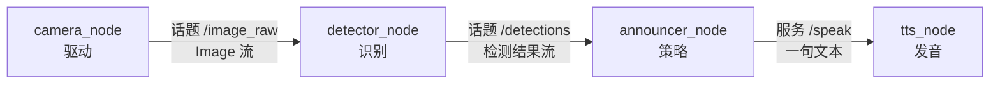

# 第 19 章 通信：话题、服务、参数、Action

| 字段 | 内容 |
|------|------|
| 状态 | 进行中 |
| 周次 | Week 11–13 |
| 路线 | 主干 |
| 对应项目 | `P04` |
| 所属篇 | `part3` |

## 需要掌握

- 能讲清话题是多对多数据流，服务是客户端按服务名做一次请求—应答（服务端之间不会自动互调）
- 会为连续传感、偶发命令、长任务、配置分别选型：topic / service / action / param
- 能把「摄像头 → 识别 → 播报」拆成多个节点，而不是一个进程里读图+模型+发音
- 自定义 srv/msg 与 launch 拉起多节点；P04 同一包四种原语各出现一次

## 关键内容

节点只靠具名接口通信。话题适合图像和检测结果这种流；服务适合「说一句话」这种问完要等说完；Action 适合可取消的长任务；参数是挂在节点上的配置，不是传感器通道。
服务不会和服务通信：一个节点提供 `/speak`，另一个节点当客户端去调这个名字。要把识别和播报串起来，需要中间的策略节点把话题流变成服务调用。
摄像头场景：camera 只发图，detector 只发检测，announcer 决定何时说，tts 只负责发音。本周用字符串假数据跑通形状即可。P04 四种原语要在同一 launch 里能指出来；TF 遥控车留给第 20 章。

## 推荐学习资料

### 必看（掌握本章）

- [fishros/d2l-ros2 第 3–4 章](https://github.com/fishros/d2l-ros2) — 话题与服务
- [Understanding topics](https://docs.ros.org/en/humble/Tutorials/Beginner-CLI-Tools/Understanding-ROS2-Topics/Understanding-ROS2-Topics.html) / [services](https://docs.ros.org/en/humble/Tutorials/Beginner-CLI-Tools/Understanding-ROS2-Services/Understanding-ROS2-Services.html) / [actions](https://docs.ros.org/en/humble/Tutorials/Intermediate/Understanding-ROS2-Actions/Understanding-ROS2-Actions.html) — CLI 先摸清形态
- [Writing a simple service and client (Python)](https://docs.ros.org/en/humble/Tutorials/Beginner-Client-Libraries/Writing-A-Simple-Py-Service-And-Client.html) — 过实验 C

### 进阶拓展

- QoS（可靠/尽力、深度）— 激光与无线丢包时必看官方 QoS
- 生命周期节点 — Nav2 里大量使用，第 26 章对照
- 组件容器与零拷贝 — 性能选修

## 笔记

以下整理自对 ROS 2 通信原语、以及「摄像头 → 识别 → 语音播报」该怎么拆节点的讨论。做完实验后把输出和截图补进文末表。

### 通信机制先看一张图

ROS 2 里跑着的软件是一张 **计算图（graph）**：点是 **节点（node）**，边是 **具名接口**（话题名、服务名、Action 名）。节点启动后由 DDS 做发现，你不用写 IP。节点之间 **禁止靠 `import` 对方的类来「直接调用」**；只认接口名字和消息类型。

四种原语职责不同，不要四种都往一个数据通道上堆：

| 原语 | 形态 | 谁对谁 | 典型用途 |
|------|------|--------|----------|
| 话题 Topic | 持续的数据流，发布 / 订阅 | 多对多，匿名 | 图像、激光、速度、检测结果 |
| 服务 Service | 一次请求、一次应答 | 客户端找 **服务名**（通常一对一） | 清图、开关、播报一句、查询状态 |
| Action | 目标 → 过程反馈 → 最终结果，可取消 | 客户端找 Action 名 | 导航到点、抓取、较长的语音 |
| 参数 Parameter | 挂在某个节点上的配置 | 按节点名读写 | 阈值、设备号、语言，不是传感器流 |

底层都走 DDS，但对写节点的人来说：话题是「一直在广播」，服务是「问一句等一句」，Action 是「拜托做一件可能要做很久的事」。

### 话题：发布 / 订阅

- **发布者（publisher）** 往某个 **话题名** 上扔固定类型的消息（如 `sensor_msgs/msg/Image`）。
- **订阅者（subscriber）** 按同一名字、同一类型注册回调；消息来了就进你的函数。
- 发布者不知道有没有人听，也不知道听的人是谁。可以 0、1、N 个订阅者。也可以多个发布者往同一话题挤（通常要避免抢同一控制量）。
- 频率由发布者的定时器或驱动决定。激光 10 Hz、图像 30 Hz，都是话题的典型节奏。
- QoS（可靠性、队列深度）决定丢包时「要最新」还是「每条都要」。相机常用尽力+小队列；命令偶尔用可靠。细节放进阶资料，本周能 `echo` / `hz` 即可。

第 18 章的 `/chatter`、turtlesim 的 `/turtle1/cmd_vel` 都是话题。

### 服务：不是「服务和服务通信」

容易说错的一点：**服务不会互相打电话。** 提供服务的是 **节点 A（服务端）**，调用服务的是 **节点 B（客户端）**。B 连的是 **服务名**（如 `/speak`），不是节点名。

一次调用的过程：

1. 服务端 `create_service(类型, 名字, 回调)`，在图上挂出这个名字。
2. 客户端 `create_client`，等到 `service_is_ready`（服务端必须已经起来）。
3. 客户端填 **Request** 发出去；服务端回调里读 Request，填 **Response** 返回。
4. 这次交互结束。没有「订阅流」，也没有中间进度（要进度就用 Action）。

所以：

- 两个服务端并排挂着 `/detect` 和 `/speak`，它们 **不会自动串起来**。必须有一个节点既当 `/detect` 的客户端、又当 `/speak` 的客户端，或者一边当服务端一边当另一边的客户端。
- 同一名字上通常只应有一个服务端；客户端可以有多个，但每次调用仍是一次一答。
- 服务不适合图像这种高频流：每帧都 `call` 会堵住、也难取消。

命令行自测：`ros2 service list`、`ros2 service type`、`ros2 interface show`、`ros2 service call`。

### Action 和参数（用来配对选型）

- **Action**：内部其实是若干话题（goal / feedback / result / cancel）。适合「去厨房」这种长任务：能反馈进度、能取消。TTS 若一句要 5 秒且可能被打断，用 Action 比服务更合适；只说一个词、说完就算，用服务就够。
- **参数**：改行为不改代码，例如识别置信度、摄像头 `/dev/video0`、是否开播报。参数不是「识别结果」该走的路；结果仍用话题或服务返回。

### 场景设计：摄像头取图 → 识别物体 → 读出名字

目标功能：**看到物体，用麦克风/喇叭说出名字。** 错误做法是一个节点里 `cap.read()`、跑 YOLO、再 `pyttsx3.say()`——换相机、换模型、换语音引擎都要改同一文件，也无法单独重放识别结果。

推荐拆成四个节点（本周可以用 `std_msgs/String` 假数据代替真图像和真 TTS）：



| 节点 | 只做什么 | 通信 |
|------|----------|------|
| `camera_node` | 打开相机，按帧发布图像 | 发布 `/image_raw`（话题）。不认识 YOLO，不发音。 |
| `detector_node` | 订阅图像，做识别 | 发布 `/detections`（话题）。阈值用 **参数** `confidence`。不负责「这句该不该说」。 |
| `announcer_node` | 把「流」变成「该说的事件」 | 订 `/detections`；同一物体连续 30 帧只说一次；调用 `/speak`。 |
| `tts_node` | 把文本变成声音 | **提供** `/speak` 服务（或 Speak Action）。不订阅图像。 |

为什么图像和检测用话题：它们是传感器式的连续流，RViz、录包、第二个调试节点都可以同时订。

为什么播报用服务（或 Action），不用话题：若 detector 以 10 Hz 往 `/speech` 发 `cup`，喇叭会卡死在同一句话上。播报是 **偶尔一次、需要知道说完没有** 的事，符合请求—应答。句子很长或要取消时，把 `/speak` 升级成 Action，announcer 当 Action 客户端即可，camera / detector 不用改。

为什么必须有 announcer：识别频率和说话频率不是一回事。去抖、冷却时间、优先级（同时看到杯子和人说哪个）都属于策略，不要写进驱动或模型节点。

参数放哪：`confidence` 在 detector；`language` / `voice` 在 tts；`min_repeat_s` 在 announcer。用 `ros2 param set` 调，不必重编。

本周落地：不必接真相机。detector 用定时器发布 `"cup"` / `"book"` 字符串，tts 只打日志，先把 **图的形状** 跑通。真 `sensor_msgs/Image` 和语音包放到感知篇再换进去，接口可以保持不变。

### 自定义接口（P04 会碰到）

需要自己的字段时，在接口包里写 `.msg` / `.srv` / `.action`，例如 `Speak.srv`：

```
string text
---
bool ok
```

`---` 上面是 Request，下面是 Response。节点依赖这个接口包，而不是把结构写在 Python `dict` 里私传。能用 `std_msgs`、`sensor_msgs`、`std_srvs` 就先用标准的。

### 实验记录（做完再填）

| 实验 | 日期 | 通过？ | 输出摘要 / 截图 | 踩坑 |
|------|------|--------|-----------------|------|
| A 场景设计图 |  |  |  |  |
| B turtlesim 服务 |  |  |  |  |
| C 自写 /speak |  |  |  |  |
| D 流 + 事件 |  |  |  |  |
| E 参数 |  |  |  |  |
| F launch 四种原语 |  |  |  |  |

## 实验清单

每条先写清要回答的问题。在 Ubuntu 里做；每个终端先 source 系统 ROS，再用到自己的包时 overlay 工作空间。相机和 YOLO **本周用假数据**；真相机放到第四篇。建议继续用第 18 章的工作空间，或在 `~/ros2_ws/src` 新建 `demo_comm`。

- [ ] **实验 A：只设计、不写代码（摄像头场景）**
    - **要回答的问题**：图像、检测结果、播报、阈值分别该走话题、服务、Action 还是参数？节点怎么拆，才不会焊成一个进程？
    - **步骤**：在笔记「实验记录」里画出节点图（可手绘拍照），填一张表：节点名、发布/订阅的话题、提供/调用的服务、参数。对照本章笔记里的四节点拆法，写下你若合并某两个节点会坏在哪。
    - **通过线**：图上至少 3 个节点；图像是话题；播报不是每帧一条话题；有一个节点专门做「何时说」，而不是让 detector 直接发音。没有代码也可以勾。

- [ ] **实验 B：服务是一次一答（先用现成服务看清形态）**
    - **要回答的问题**：服务端和客户端谁先存在？请求和响应各长什么样？它和 `ros2 topic echo` 有什么不同？
    - **步骤**（三个终端均已 source）：
        1. `ros2 run turtlesim turtlesim_node`
        2. `ros2 service list`，找到 `/spawn`、`/clear`、`/turtle1/set_pen` 一类名字。
        3. `ros2 service type /clear`，再 `ros2 interface show` 该类型（例如 `std_srvs/srv/Empty`）。
        4. `ros2 service call /clear std_srvs/srv/Empty`，看海龟轨迹是否被清掉。
        5. `ros2 service call /spawn turtlesim/srv/Spawn "{x: 2.0, y: 3.0, theta: 0.0, name: 'leo'}"`，再 `ros2 node list` / `ros2 topic list` 看是否多了一只龟的话题。
    - **通过线**：能口述：调用的是 **服务名**，不是节点名；应答回来之前这次调用没结束；`/turtle1/pose` 仍是话题在连续刷，和 `/clear` 不是一类东西。把一次 `service list` 和一次 `call` 的输出贴进笔记。

- [ ] **实验 C：自己写一个 `/speak` 服务（假 TTS）**
    - **要回答的问题**：节点如何 **提供** 服务、另一个节点如何 **调用**？两个服务会不会自动互调？
    - **步骤**：
        1. 需要「一句话」时，跟 [Creating custom srv](https://docs.ros.org/en/humble/Tutorials/Beginner-Client-Libraries/Custom-ROS2-Interfaces.html) 做 `Speak.srv`（Request: `string text`，Response: `bool ok`）。练手也可用 `example_interfaces`。
        2. `tts_node`：`create_service`，回调里 `get_logger().info('speaking: ...')`，再填 `ok=True`（本周不接真实喇叭也行）。
        3. 命令行当客户端：`ros2 service call /speak <你的类型> "{text: 'cup'}"`，日志里出现 `cup`。
        4. 再写 `announcer`：`create_client`，等到 `service_is_ready`，再 `call_async`。确认 tts **没有** `import` announcer，announcer **没有** 直接调 tts 的类。
    - **通过线**：只启动 tts 时，`ros2 service list` 有 `/speak`；再 `service call` 或启动 announcer 能看到日志。笔记写一句：服务端不主动找客户端，是客户端找服务名。

- [ ] **实验 D：话题流 + 服务事件（假识别不要每帧都说）**
    - **要回答的问题**：连续检测结果为什么用话题？怎样避免 10 Hz 的「杯子」被念十遍？
    - **步骤**：
        1. `detector_node` 用定时器（例如 2 Hz）发布 `std_msgs/String` 到 `/detections`，内容在连续多帧 `cup` 和偶尔一次 `book` 之间切换。
        2. `announcer` 订阅 `/detections`：仅当标签 **相对上次已播报发生变化** 时，才调用 `/speak`。
        3. 三个节点一起跑（可先三个终端 `ros2 run`）。
        4. `ros2 topic echo /detections` 应很密；tts 日志应明显更稀，连续 `cup` 只播报一次。
    - **通过线**：能讲清 announcer 把「流」变成「事件」。`rqt_graph` 截图：detector → `/detections` → announcer，announcer 与 tts 之间是服务不是话题。

- [ ] **实验 E：参数改行为，不改代码**
    - **要回答的问题**：配置和数据通道有什么区别？
    - **步骤**：给 `announcer` 声明参数 `min_repeat_s`（默认 2.0），或给假 detector 声明当前 `label`。运行中 `ros2 param get <节点> <名>`，再 `ros2 param set ...` 看行为变化。
    - **通过线**：不重新编译，只 set 参数就能改变行为。笔记记下参数属于哪个节点。

- [ ] **实验 F（P04 本章部分）：同一包里四种原语都出现 + launch**
    - **要回答的问题**：四种原语能否在一个 launch 里同时被看到，而不是四个互不相关的 demo？
    - **步骤**：在 `demo_comm` 或 `projects/p04_ros2_ws` 里让假场景具备：话题 `/detections`、服务 `/speak`、至少一个参数、一个最小 Action（官方 [Writing an action server and client (Python)](https://docs.ros.org/en/humble/Tutorials/Intermediate/Writing-an-Action-Server-Client/Py.html)，Goal 可用「播报秒数」冒充长任务）。`ros2 launch ...` 一键起。TF / URDF 遥控车是第 20 章和 P04 门禁后半，**不必本实验做完**。
    - **通过线**：`ros2 topic list`、`ros2 service list`、`ros2 action list`、`ros2 param dump <某节点>` 各能指到场景里的一个名字。README 写出发行版和 launch 命令。

## 复盘

- 卡住的地方：
- 下一章开始前必须补上的漏洞：
