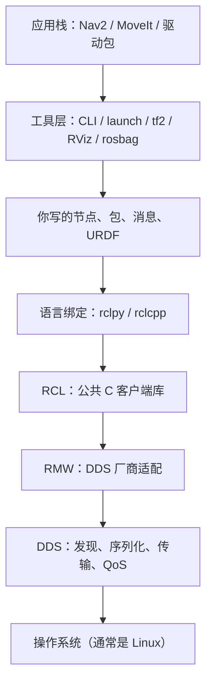

以下整理自对 ROS 2「解决什么、怎么分层、个人写什么」的讨论。做完实验后，把命令输出、截图和踩坑补在文末表格里。

### ROS 2 主要解决什么

机器人软件几乎从来不是一个进程。激光驱动、定位、规划、控制、可视化各自独立跑，还要能换实现、能多机、能复用别人的包。

ROS 2 当 **中间件 / 操作系统式的胶水**，专门处理这几件事：

1. **发现**：节点起来之后，不用手写 IP 和端口，图上的其他节点能找到它（相对 ROS 1，不再依赖一个必须先起的 `roscore`）。
2. **通信**：按约定的消息类型传数据（话题、服务、动作），并带上 QoS（可靠性、队列深度等）。
3. **启动与配置**：用 launch 一次拉起一堆节点，用参数改行为而不改代码。
4. **生态接口**：大家都用 `geometry_msgs/Twist`、`sensor_msgs/LaserScan` 这类标准消息，包才能插在一起。

它 **不代替算法**。EKF、A*、PID、逆运动学仍是第二篇那些公式；ROS 2 只决定「算完的结果从哪个话题出去、从哪个话题进来」。算法没懂就写节点，会在 launch 和 TF 里迷路。

对照本书：第 10 章是定位算法本身；本章是把「会算」变成「能作为系统的一块积木」。

### 架构怎么分层

教学上可以记成下面这一叠。官方还会拆得更细，个人开发先记住职责边界即可。

| 层 | 作用 | 个人要不要碰 |
|----|------|----------------|
| 操作系统 | 进程、网络、时间 | 装 Ubuntu；不管内核 |
| DDS | 谁在网上、字节怎么发、QoS 怎么守 | 装好发行版自带的实现即可 |
| RMW | 换 Fast DDS / Cyclone 时不改节点代码 | 多机或丢包时才查，本周不改 |
| RCL | 节点、图、时间、日志的公共语义 | 不读源码也能用 |
| rclpy / rclcpp | 用 Python 或 C++ 调同一套概念 | **每天调用，不改库本身** |
| 节点 / 包 | 真正的业务：订阅激光、发布速度、调算法 | **主战场** |
| 工具层 | 查图、启动、看 TF、录包 | **每天用** |
| 应用栈 | 导航、机械臂、相机驱动 | 先当库用，不要第一周改源码 |

### 为什么要这么分层

- **换运输不换业务**：节点只认「话题和消息」。底下是哪家 DDS，由 RMW 挡住。
- **Python 和 C++ 同一张图**：语义在 RCL。你用 `rclpy` 写的发布者和别人用 `rclcpp` 写的订阅者可以对上。
- **工具对所有节点通用**：`ros2 topic echo`、RViz 不需要知道你的算法细节，只认图上的接口。
- **应用可以拼装**：Nav2 是一堆节点，不是一个巨石二进制。你的车只要提供激光、里程计、`cmd_vel`，就能接上去（第四篇）。

分层的代价是概念多。换来的是：不用自己维护一套 socket 协议，也不用把感知和规划焊在同一个可执行文件里。

### 个人开发主要写什么、怎么做

主战场在 **节点 / 包** 和 **工具层的用法**，不是 DDS。

本周开始就会反复写的：

1. **节点（Node）**：一个进程里的一个逻辑单元。通常「一件事一个节点」（发布速度、订阅激光、做定位）。
2. **功能包（Package）**：代码、依赖、`setup.py`/`package.xml` 的单位。`colcon` 按包编译。
3. **工作空间（Workspace）+ overlay**：自己的 `src/` 编进 `install/`，`source install/setup.bash` 叠在系统 ROS 之上。顺序永远是：**先 source 系统发行版，再 source 工作空间**。
4. **话题上的标准消息**：先用 `std_msgs`、`geometry_msgs`，不要一上来自定义十个 `.msg`。
5. **稍后（第 19–20 章）**：服务 / 参数 / Action、launch、TF、URDF。

怎么做（习惯，不是一次实验）：

- 节点之间 **只靠话题/服务耦合**，不要 `import` 另一个节点的类来「直接调用」。
- 一个包一个职责；胶水包依赖导航包，而不是把 Nav2 源码拷进自己仓库。
- 先仿真和键盘遥控，再接算法；算法先在纯 Python 里有测试，再塞进回调。
- 发行版锁死 **Humble 或 Jazzy**，不要混 ROS 1，也不要追 rolling。
- 语言：学习阶段 **Python（rclpy）足够**；驱动、高频控制再上 C++。

本周 **不要做**：改 DDS 配置、写 RMW、fork Nav2、上真机安全相关的东西。那些分别留给进阶资料、第四篇和附录。

### 实验记录（做完再填）

| 实验 | 日期 | 发行版 | 通过？ | 输出摘要 / 截图 | 踩坑 |
|------|------|--------|--------|-----------------|------|
| A 环境自检 |  |  |  |  |  |
| B turtlesim |  |  |  |  |  |
| C 工作空间 |  |  |  |  |  |
| D 发布者 |  |  |  |  |  |
| E 订阅者与计算图 |  |  |  |  |  |
