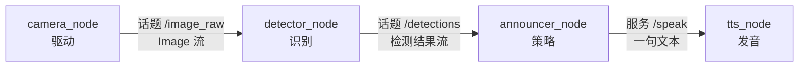

以下整理自对 ROS 2 通信原语、以及「摄像头 → 识别 → 语音播报」该怎么拆节点的讨论。做完实验后把输出和截图补进文末表。

### 通信机制先看一张图

ROS 2 里跑着的软件是一张 **计算图（graph）**：点是 **节点（node）**，边是 **具名接口**（话题名、服务名、Action 名）。节点启动后由 DDS 做发现，你不用写 IP。节点之间 **禁止靠 `import` 对方的类来「直接调用」**；只认接口名字和消息类型。

四种原语职责不同，不要四种都往一个数据通道上堆：

| 原语 | 形态 | 谁对谁 | 典型用途 |
|------|------|--------|----------|
| 话题 Topic | 持续的数据流，发布 / 订阅 | 多对多，匿名 | 图像、激光、速度、检测结果 |
| 服务 Service | 一次请求、一次应答 | 客户端找 **服务名**（通常一对一） | 清图、开关、播报一句、查询状态 |
| Action | 目标 → 过程反馈 → 最终结果，可取消 | 客户端找 Action 名 | 导航到点、抓取、较长的语音 |
| 参数 Parameter | 挂在某个节点上的配置 | 按节点名读写 | 阈值、设备号、语言，不是传感器流 |

底层都走 DDS，但对写节点的人来说：话题是「一直在广播」，服务是「问一句等一句」，Action 是「拜托做一件可能要做很久的事」。

### 话题：发布 / 订阅

- **发布者（publisher）** 往某个 **话题名** 上扔固定类型的消息（如 `sensor_msgs/msg/Image`）。
- **订阅者（subscriber）** 按同一名字、同一类型注册回调；消息来了就进你的函数。
- 发布者不知道有没有人听，也不知道听的人是谁。可以 0、1、N 个订阅者。也可以多个发布者往同一话题挤（通常要避免抢同一控制量）。
- 频率由发布者的定时器或驱动决定。激光 10 Hz、图像 30 Hz，都是话题的典型节奏。
- QoS（可靠性、队列深度）决定丢包时「要最新」还是「每条都要」。相机常用尽力+小队列；命令偶尔用可靠。细节放进阶资料，本周能 `echo` / `hz` 即可。

第 18 章的 `/chatter`、turtlesim 的 `/turtle1/cmd_vel` 都是话题。

### 服务：不是「服务和服务通信」

容易说错的一点：**服务不会互相打电话。** 提供服务的是 **节点 A（服务端）**，调用服务的是 **节点 B（客户端）**。B 连的是 **服务名**（如 `/speak`），不是节点名。

一次调用的过程：

1. 服务端 `create_service(类型, 名字, 回调)`，在图上挂出这个名字。
2. 客户端 `create_client`，等到 `service_is_ready`（服务端必须已经起来）。
3. 客户端填 **Request** 发出去；服务端回调里读 Request，填 **Response** 返回。
4. 这次交互结束。没有「订阅流」，也没有中间进度（要进度就用 Action）。

所以：

- 两个服务端并排挂着 `/detect` 和 `/speak`，它们 **不会自动串起来**。必须有一个节点既当 `/detect` 的客户端、又当 `/speak` 的客户端，或者一边当服务端一边当另一边的客户端。
- 同一名字上通常只应有一个服务端；客户端可以有多个，但每次调用仍是一次一答。
- 服务不适合图像这种高频流：每帧都 `call` 会堵住、也难取消。

命令行自测：`ros2 service list`、`ros2 service type`、`ros2 interface show`、`ros2 service call`。

### Action 和参数（用来配对选型）

- **Action**：内部其实是若干话题（goal / feedback / result / cancel）。适合「去厨房」这种长任务：能反馈进度、能取消。TTS 若一句要 5 秒且可能被打断，用 Action 比服务更合适；只说一个词、说完就算，用服务就够。
- **参数**：改行为不改代码，例如识别置信度、摄像头 `/dev/video0`、是否开播报。参数不是「识别结果」该走的路；结果仍用话题或服务返回。

### 场景设计：摄像头取图 → 识别物体 → 读出名字

目标功能：**看到物体，用麦克风/喇叭说出名字。** 错误做法是一个节点里 `cap.read()`、跑 YOLO、再 `pyttsx3.say()`——换相机、换模型、换语音引擎都要改同一文件，也无法单独重放识别结果。

推荐拆成四个节点（本周可以用 `std_msgs/String` 假数据代替真图像和真 TTS）：



| 节点 | 只做什么 | 通信 |
|------|----------|------|
| `camera_node` | 打开相机，按帧发布图像 | 发布 `/image_raw`（话题）。不认识 YOLO，不发音。 |
| `detector_node` | 订阅图像，做识别 | 发布 `/detections`（话题）。阈值用 **参数** `confidence`。不负责「这句该不该说」。 |
| `announcer_node` | 把「流」变成「该说的事件」 | 订 `/detections`；同一物体连续 30 帧只说一次；调用 `/speak`。 |
| `tts_node` | 把文本变成声音 | **提供** `/speak` 服务（或 Speak Action）。不订阅图像。 |

为什么图像和检测用话题：它们是传感器式的连续流，RViz、录包、第二个调试节点都可以同时订。

为什么播报用服务（或 Action），不用话题：若 detector 以 10 Hz 往 `/speech` 发 `cup`，喇叭会卡死在同一句话上。播报是 **偶尔一次、需要知道说完没有** 的事，符合请求—应答。句子很长或要取消时，把 `/speak` 升级成 Action，announcer 当 Action 客户端即可，camera / detector 不用改。

为什么必须有 announcer：识别频率和说话频率不是一回事。去抖、冷却时间、优先级（同时看到杯子和人说哪个）都属于策略，不要写进驱动或模型节点。

参数放哪：`confidence` 在 detector；`language` / `voice` 在 tts；`min_repeat_s` 在 announcer。用 `ros2 param set` 调，不必重编。

本周落地：不必接真相机。detector 用定时器发布 `"cup"` / `"book"` 字符串，tts 只打日志，先把 **图的形状** 跑通。真 `sensor_msgs/Image` 和语音包放到感知篇再换进去，接口可以保持不变。

### 自定义接口（P04 会碰到）

需要自己的字段时，在接口包里写 `.msg` / `.srv` / `.action`，例如 `Speak.srv`：

```
string text
---
bool ok
```

`---` 上面是 Request，下面是 Response。节点依赖这个接口包，而不是把结构写在 Python `dict` 里私传。能用 `std_msgs`、`sensor_msgs`、`std_srvs` 就先用标准的。

### 实验记录（做完再填）

| 实验 | 日期 | 通过？ | 输出摘要 / 截图 | 踩坑 |
|------|------|--------|-----------------|------|
| A 场景设计图 |  |  |  |  |
| B turtlesim 服务 |  |  |  |  |
| C 自写 /speak |  |  |  |  |
| D 流 + 事件 |  |  |  |  |
| E 参数 |  |  |  |  |
| F launch 四种原语 |  |  |  |  |
